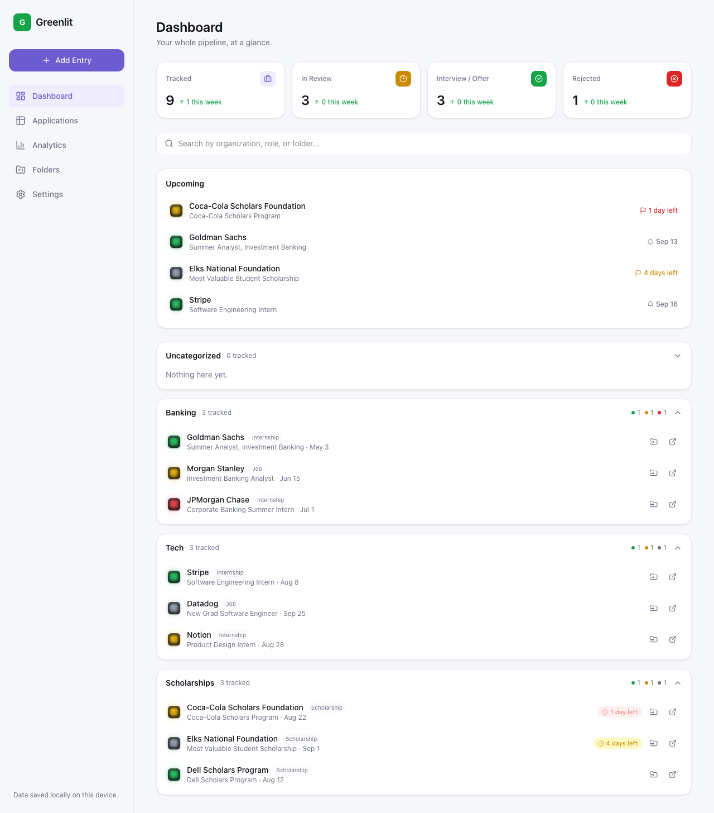
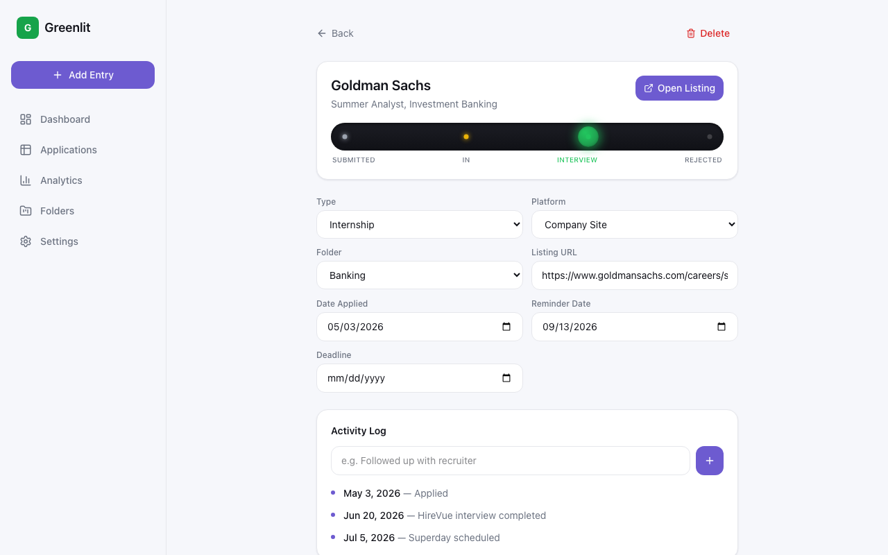
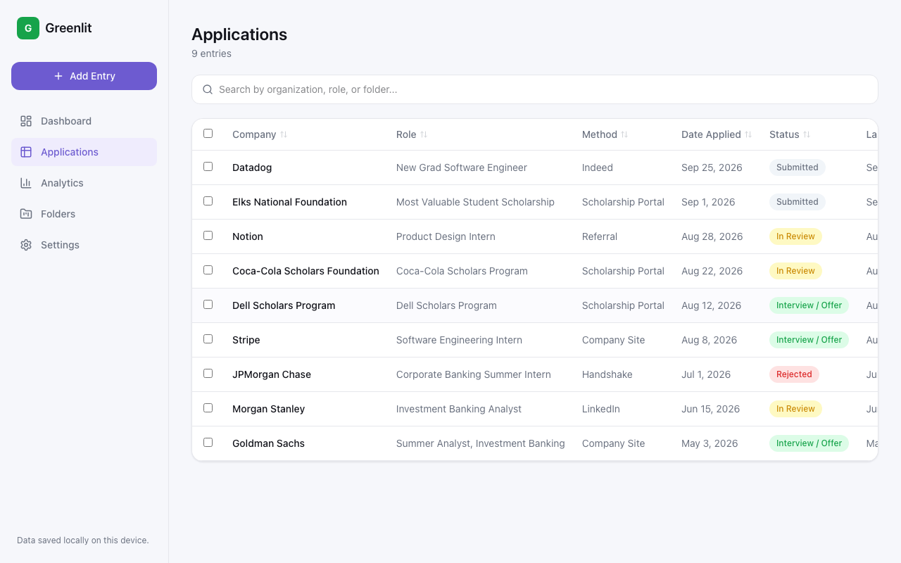
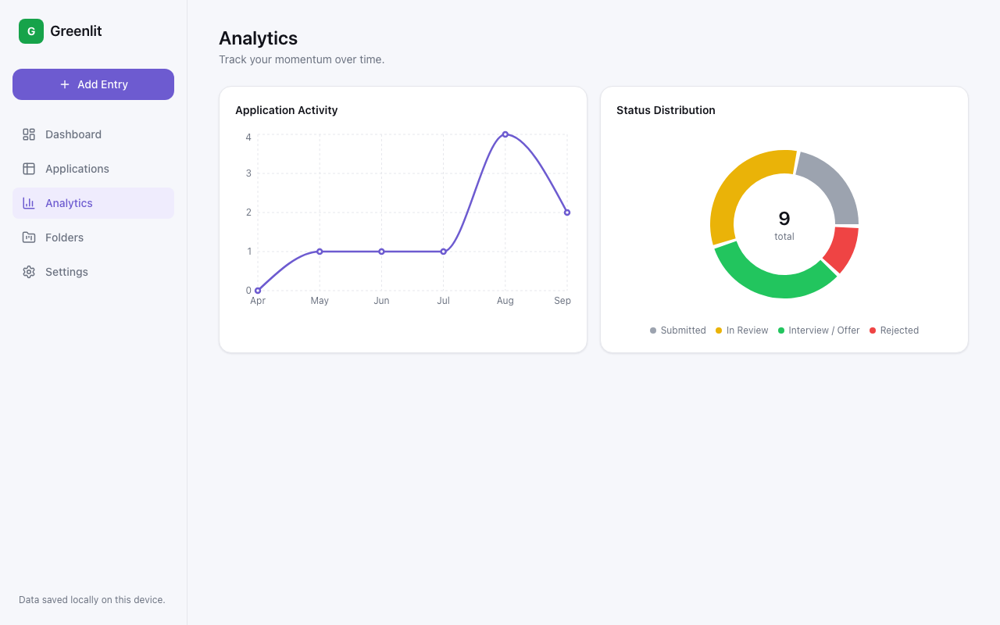
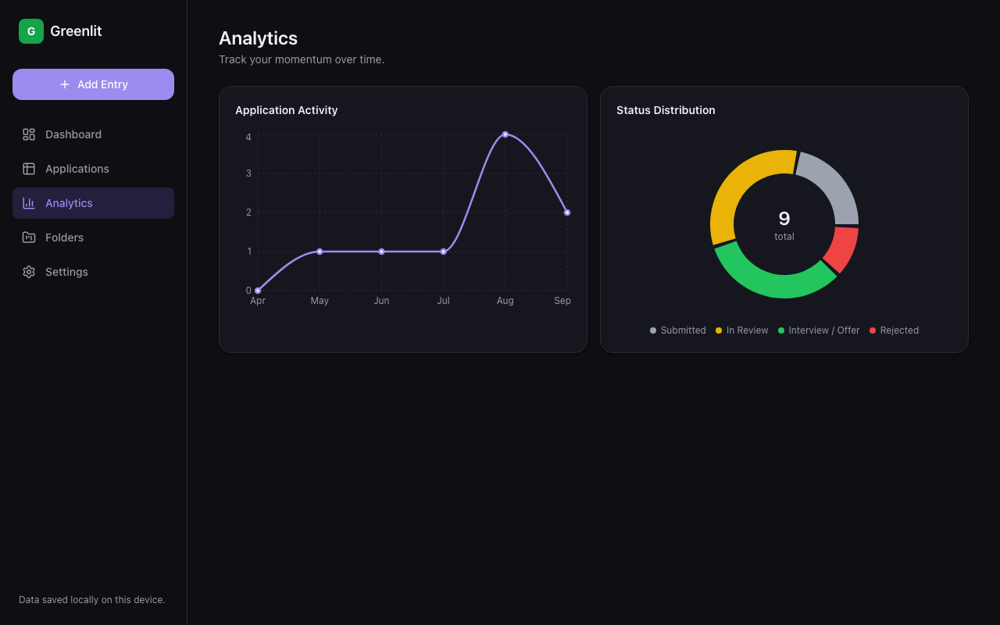
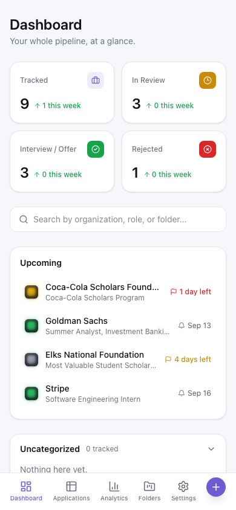

# Greenlit

**A dead-simple opportunity tracker for students juggling job, internship, and scholarship applications across a dozen different platforms.**

**[Live demo](https://greenlit-eta.vercel.app)** · Built with React, TypeScript, and Vite · deployed on Vercel



## The problem

Job hunting as a student means chaos: a LinkedIn Easy Apply here, a Handshake application there, a scholarship portal deadline buried in an email from three weeks ago. Spreadsheets are clunky on a phone. Full CRM tools (Huntr, Teal) are built for professionals tracking a handful of roles, not students firing off dozens of applications between classes. Nothing was built for the actual shape of this problem: fast logging, at-a-glance status, and reminders that don't let a scholarship deadline slip through the cracks.

## The solution

Greenlit is a tracker built around three ideas:

- **Speed first.** Adding an entry takes under 15 seconds — paste a URL, and Greenlit auto-detects the platform (LinkedIn, Indeed, Handshake) so there's less to type.
- **One motion to update status.** The signature interaction is a status slider — drag or tap to move an application from Submitted → In Review → Interview/Offer → Rejected, no drilling into menus.
- **Nothing time-sensitive gets buried.** Every entry can carry a reminder or a hard deadline, both of which surface on a single "Upcoming" panel with countdown badges that escalate from neutral to yellow (within a week) to red (within 48 hours).

Everything is organized into folders the user defines themselves — "Banking," "Scholarships," "Sports Business" — because a generic CRM's fixed pipeline stages don't map to how a student actually thinks about a stack of applications.

## Feature highlights

- **Folder-based dashboard** (screenshot above) with expandable panels, per-folder status breakdowns, and stat cards showing week-over-week trend deltas.
- **Status slider** — a custom drag-and-tap control (built on pointer events, no library) that's the one place in the UI built to feel a little dramatic, echoing a traffic-light signal housing with a glowing, textured lens. Paired with a running activity log timeline instead of one flat notes field.

  

- **Deadline urgency tiers** — automatic color escalation (neutral → yellow within a week → red within 48 hours) and a live countdown ("3 days left") on any entry with a hard cutoff, most useful for scholarships. Flagged entries float to the top of the Upcoming panel regardless of folder.
- **Sortable table view** for scanning a large pipeline at once, alongside the folder/card view.

  

- **Analytics** — a monthly activity line chart and a status-distribution donut, both built to make the case that this is more than a CRUD app.

  

- **Dark mode**, persisted per device.

  

- **Mobile-first** — a bottom tab bar replaces the sidebar below `md`, and Add Entry is built to take under 15 seconds on a phone.

  

- **Full data portability** — JSON and CSV export/import, since there's no backend and no login: everything lives in `localStorage` on-device.
- **Smart application links** — every entry has a first-class URL field and a one-tap "Open Listing" button. Greenlit doesn't (and can't, without breaking platform terms) auto-submit applications on LinkedIn/Indeed/Handshake — instead it gets you to the listing fast and suggests **Claude in Chrome** as a companion for filling out the form in your own browser session.

## Tech stack

- **React 19 + TypeScript + Vite** — fast dev loop, typed data model end to end.
- **Tailwind CSS v4** — utility-first styling with CSS custom properties driving the light/dark theme.
- **React Router** — client-side routing (hash-based, so it deploys as a static site with zero server config).
- **Recharts** — the analytics line and donut charts.
- **`localStorage`** — the entire persistence layer. No backend, no auth, zero friction to start using it.
- **Vercel** — static hosting/deployment.

## Architecture notes

- All state lives in a single `AppStoreProvider` (React Context + `useState`), synced to `localStorage` on every change. No external state library — the data model is small enough that this stays simple and typed.
- The status slider measures its own track width via `ResizeObserver` rather than relying on CSS `calc()` with mixed percentage units, which don't compose the way you'd expect for a draggable thumb.
- Platform auto-detection (`src/lib/platform.ts`) parses the pasted URL's hostname against known job platforms so the form pre-fills without an API call.
- Urgency tiers for deadlines are computed from hours-until-due (`src/lib/dates.ts`) so "48 hours" and "1 week" thresholds don't drift based on time-of-day rounding.

## Running locally

```bash
npm install
npm run dev
```

```bash
npm run build    # production build to dist/
npm run preview  # preview the production build locally
```

## My role

Designed and built end to end — data model, component architecture, the custom status-slider interaction, and the visual system (light SaaS base with a deliberately detailed "signal light" status badge as the one dramatic accent).
